# Responsive Product Landing Page

A modern, responsive landing page built for **Monte Coffee**, a local café located in Sitio 6, Brgy. Patimbao, Santa Cruz, Laguna. This project was made using **Laravel**, **Blade Components**, and **Tailwind CSS**.

---

## 1. Introduction

### What is a Product Landing Page?
A landing page is a single web page made to introduce a business, product, or service to visitors. It is usually the first page people see when they search for a business online. A good landing page shows what the business offers, why it is worth trying, and how customers can reach or order from them.

### Why Landing Pages Are Important for Businesses?
Many small businesses, like local cafés, do not have a website yet. A landing page helps them:
- Look more professional online
- Show their menu, prices, and photos in one place
- Make it easier for customers to find their location and contact details
- Attract new customers who find them through search or social media
- Build trust, since a business with a clean website feels more credible

### Purpose of This Project
This project was made to give Monte Coffee a simple, modern, and mobile-friendly website. The goal is to turn their existing Facebook page content (menu, photos, and branding) into a real, working landing page using Laravel and Tailwind CSS.

---

## 2. Objectives

By finishing this project, the following learning objectives were achieved:

- Built responsive web pages using Tailwind CSS
- Applied responsive design so the page works well on desktop, tablet, and mobile
- Organized all frontend files following Laravel's recommended folder structure
- Used consistent colors, fonts, spacing, and layout across the whole page
- Practiced documenting a frontend project properly
- Prepared the project to be shared as part of a developer portfolio

---

## 3. Responsive Web Design

### Mobile-First Design
This project was designed with small screens in mind first, then improved for bigger screens. This is called "mobile-first." In Tailwind CSS, this means writing the normal classes for mobile, then adding classes like `md:` or `lg:` to change the layout on bigger screens.

Example from this project:
```html
<h1 class="text-4xl sm:text-5xl md:text-6xl">
    Crafted Coffee, Brewed with Passion.
</h1>
```
This heading is smaller on phones (`text-4xl`) and grows bigger as the screen size increases (`sm:text-5xl`, `md:text-6xl`).

### Responsive Breakpoints
Tailwind CSS has built-in screen sizes called breakpoints:

| Breakpoint | Screen Width | Used For |
|---|---|---|
| (default) | below 640px | Mobile phones |
| `sm:` | 640px and up | Large phones |
| `md:` | 768px and up | Tablets |
| `lg:` | 1024px and up | Small laptops |
| `xl:` | 1280px and up | Desktops |

### Flexbox
Flexbox is used to line up items in a row or column and space them evenly. This project uses it in the navigation bar to place the logo, links, and buttons side by side.

```html
<nav class="flex items-center justify-between">
    <!-- logo, links, buttons -->
</nav>
```

### CSS Grid
Grid is used when items need to be arranged in rows **and** columns, like the menu/features section and the pricing cards.

```html
<div class="grid grid-cols-1 sm:grid-cols-2 lg:grid-cols-3 gap-6">
    <!-- feature cards -->
</div>
```
This shows 1 card per row on mobile, 2 per row on tablet, and 3 per row on desktop.

### User Experience (UX)
Good UX means the website is easy and pleasant to use. This project focused on:
- Clear buttons that are easy to tap on mobile
- Enough spacing so text does not feel crowded
- Animations that appear smoothly when scrolling, instead of everything popping up at once
- Readable text with good contrast against the background

### Why Responsive Design Matters in Modern Web Applications
Most people today browse the internet using their phones. If a website does not adjust properly, buttons may be too small to tap, text may be cut off, or images may look broken. Responsive design makes sure every visitor, no matter what device they use, can still read the menu, see the photos, and easily navigate the said applications.

---

## 4. Tailwind CSS

### Utility-First CSS
Tailwind CSS is different from regular CSS. Instead of writing your own custom class names and separate CSS files, Tailwind gives ready-made small classes (called utility classes) that you add directly to your HTML. Each class does one small job, like adding padding, changing text color, or rounding corners.

### Advantages of Tailwind CSS
- No need to switch between HTML and CSS files while designing
- Faster to build pages since classes are ready to use
- Easier to keep designs consistent, since the same class names are reused everywhere
- Very easy to make a page responsive using breakpoint prefixes like `md:` or `lg:`

### Responsive Utility Classes
Example used in this project's hero section buttons:
```html
<div class="flex flex-wrap gap-4 mt-8">
    <!-- buttons here stack on small screens automatically because of flex-wrap -->
</div>
```

### Component Styling Example
Example of a feature card style from this project:
```html
<div class="bg-white rounded-[2rem] p-6 shadow-md hover:shadow-2xl hover:-translate-y-2 transition-all duration-500">
    <!-- product photo, name, description -->
</div>
```
Here, `rounded-[2rem]` makes rounded corners, `shadow-md` adds a soft shadow, and `hover:-translate-y-2` makes the card lift up slightly when the mouse hovers over it.


---

## 5. Blade Components

### What Are Blade Components?
Blade is Laravel's templating system. A Blade Component is a small, reusable piece of HTML code saved in its own file, which can then be used again and again across different pages just by writing a short tag like `<x-navbar />`.

### Why Reusable Components Improve Maintainability
Without components, the same navbar or footer code would need to be copied and pasted onto every single page. If something needs to change later — like updating the logo or a phone number — it would have to be changed on every page one by one. With components, it only needs to be changed **once**, inside that one component file, and it updates everywhere it is used.

### Benefits of Modular UI Development
- Less repeated code
- Easier to fix bugs, since there is only one file to check
- Easier for teams to work on different components at the same time
- Makes the project folder more organized and easier to understand

### Components Used in This Project

| Component File | Purpose |
|---|---|
| `navbar.blade.php` | Top navigation bar with logo and menu links |
| `hero.blade.php` | Main introduction section with headline and photo |
| `feature-card.blade.php` | Reusable card used to show each menu item |
| `pricing-card.blade.php` | Reusable card used to show each pricing plan |
| `testimonial-card.blade.php` | Reusable card used to show each customer review |
| `button.blade.php` | Reusable button style used across the whole page |
| `footer.blade.php` | Bottom section with contact info and social links |
| `icon.blade.php` | Reusable SVG icons used instead of emojis |
| `section-heading.blade.php` | Reusable heading and subtitle style for each section |
| `showcase.blade.php` | Section showing the menu, ambiance, and mobile order preview |
| `gallery.blade.php` | Photo grid gallery section |
| `cta.blade.php` | "Call to Action" section near the bottom of the page |

### Sample Code:

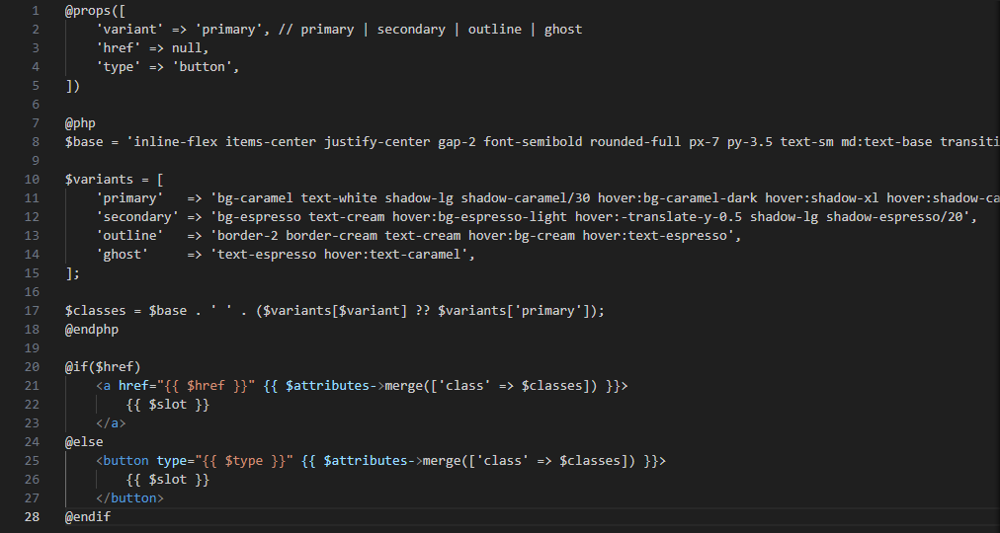

---

## 6. User Interface Design

### Color Palette
The website uses a warm, coffee-inspired color palette so it feels cozy and matches the café's branding:

| Color Name | Hex Code | Used For |
|---|---|---|
| Espresso (dark brown) | `#2A1810` | Background of dark sections, text |
| Cream | `#FBF3E7` | Light section backgrounds |
| Caramel (gold/orange) | `#C9884A` | Buttons, highlights, accents |
| Rust | `#8B4A2B` | Secondary accent color |

### Typography
Two fonts are used together to give the page character:
- **Fraunces** — used for headings and titles, gives a warm, elegant, hand-crafted feel
- **Manrope** — used for paragraphs and normal text, easy to read on all screen sizes

### Iconography
Instead of using emojis, this project uses custom SVG line icons through a reusable `<x-icon>` component (icons like a map pin, phone, coffee cup, and more). This keeps the design looking clean and professional instead of casual.

### Button Styles
All buttons share the same reusable `button.blade.php` component with different variants:
- **Primary** — solid caramel background, used for main actions like "Order Now"
- **Secondary** — solid dark brown background
- **Outline** — transparent background with a border, used for less important actions

### Card Design
Cards (used for menu items, pricing, and testimonials) all share a similar style: white background, rounded corners, soft shadow, and a hover effect that slightly lifts the card up. This makes the whole page feel consistent.

### Layout Consistency
Every section follows the same spacing pattern (padding, margins) and the same maximum width, so the page feels balanced and organized from top to bottom instead of random section to section.

### How This Improves User Experience
A consistent color palette, readable fonts, and matching button and card styles make the website easier to understand and more pleasant to look at. Visitors can quickly tell what is clickable, what is a title, and what is just descriptive text — without feeling confused.

---

## 7. Folder Structure

```
week05-product-landing-page/
│
├── app/
├── resources/
│   ├── views/
│   │   ├── layouts/          → Contains app.blade.php, the main layout every page extends
│   │   ├── components/       → Contains all reusable Blade Components (navbar, hero, cards, etc.)
│   │   └── pages/            → Contains the actual pages, like home.blade.php
│
├── public/
│   └── images/                → Stores the logo and menu photos used on the site
│
├── screenshots/               → Stores images used for this documentation
│
├── documentation/             → Stores before-and-after comparison images
│
└── README.md
```

- **`layouts/`** holds the base HTML structure (head tags, fonts, scripts) that every page shares.
- **`components/`** holds small reusable pieces of the page that can be reused anywhere.
- **`pages/`** holds full pages, like the homepage, which are built by combining components together.
- **`public/images/`** stores images that need to be shown on the actual website.
- **`screenshots/`** and **`documentation/`** are just for this README, to show proof of the design process.

---

## 8. Screenshots

**[Insert your screenshots below each heading. Take these using your browser's Developer Tools (press F12, then click the phone/tablet icon to test different screen sizes).]**

### Desktop View
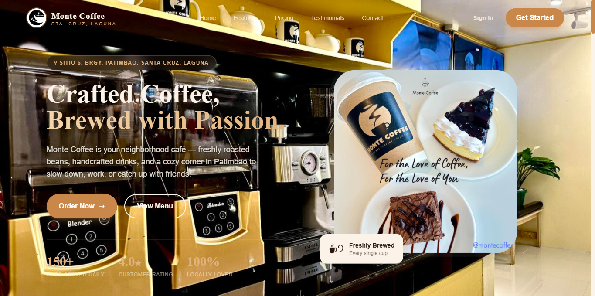

### Tablet View
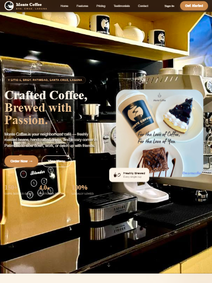

### Mobile View
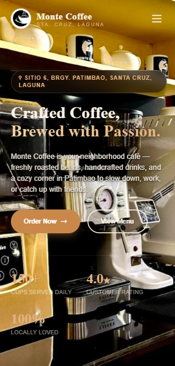

### Navigation Bar


### Hero Section
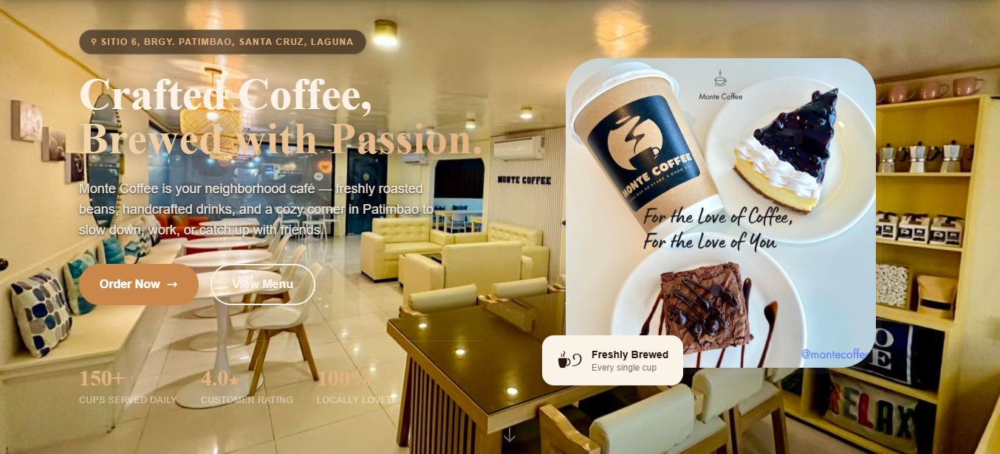

### Features Section
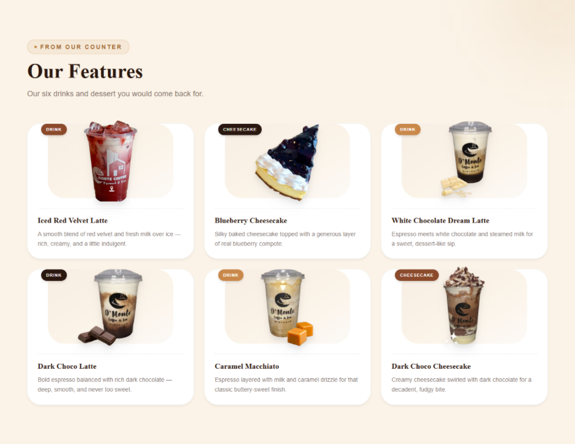

### Pricing Section
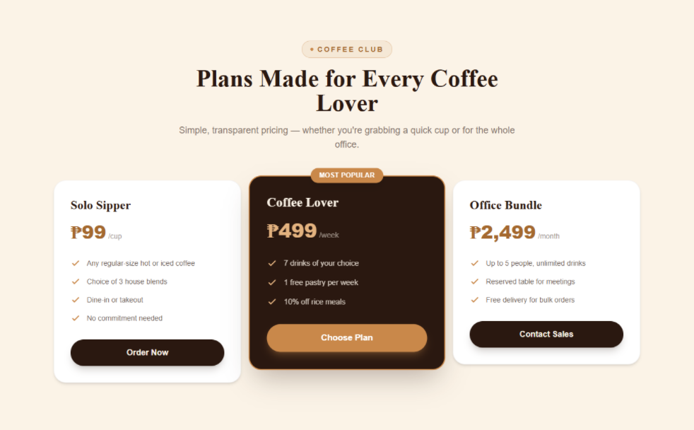

### Testimonials Section
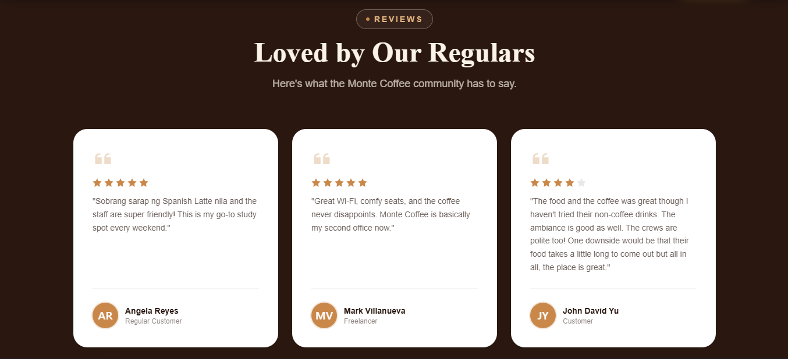

### Footer
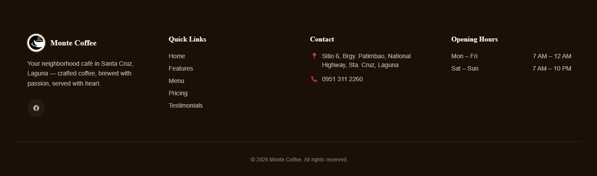

### Blade Components Folder
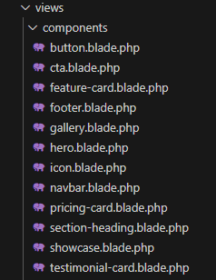

### GitHub Repository
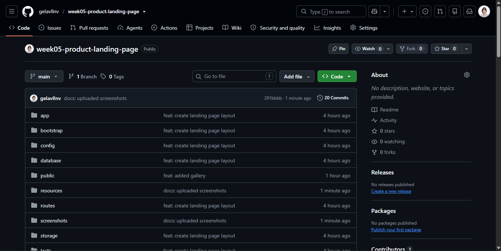

---

## Before-and-After Comparison

### Before
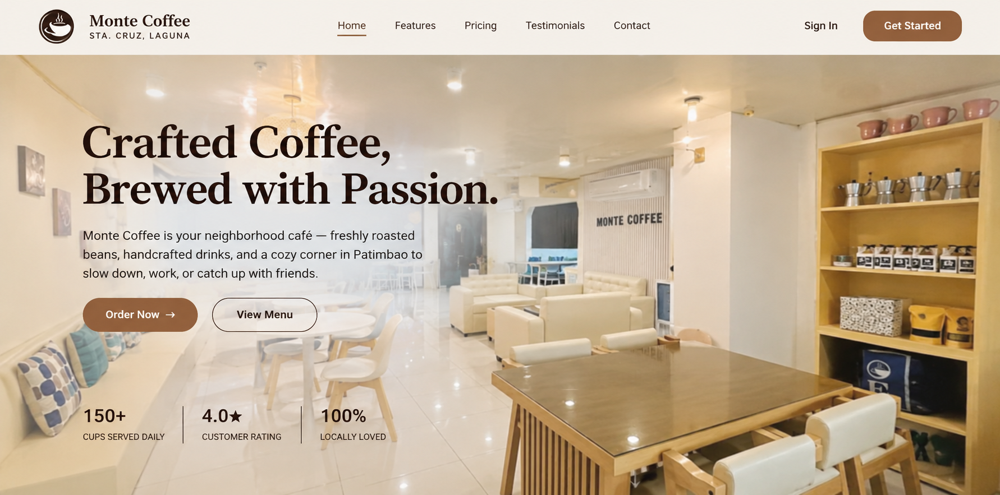

### After
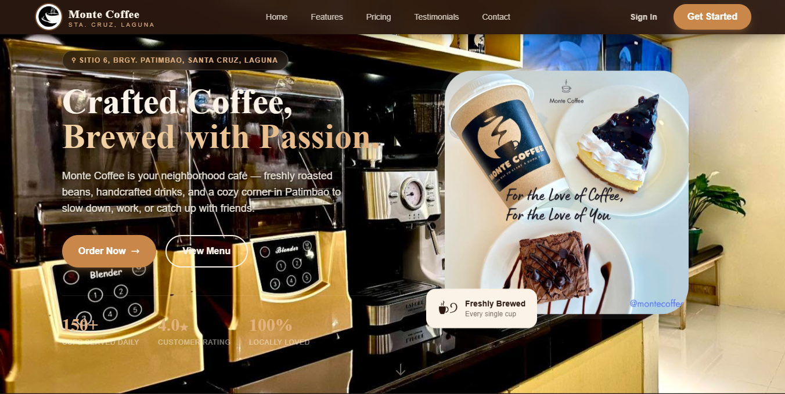

---

## Tech Stack Used

- **Laravel** — backend framework and Blade templating
- **Tailwind CSS** — styling and responsive design
- **Alpine.js** — for small interactive behavior like the mobile menu and menu tabs
- **AOS (Animate On Scroll)** — for smooth scroll animations
- **Swiper.js** — for the hero background photo carousel and testimonial carousel

---

Developed by **Mary Angela T. Villanueva**
For **ITST 302 – Client-Server Technologies**, Week 5 Mini Project 04